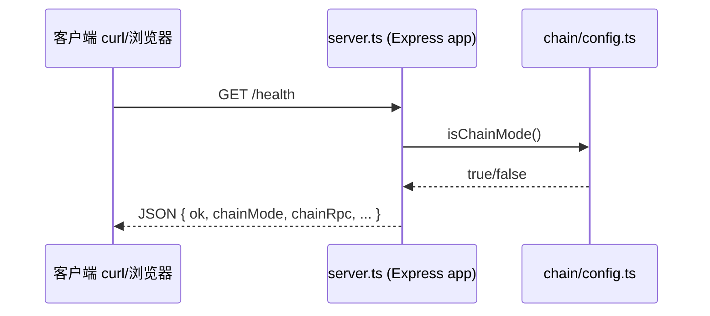
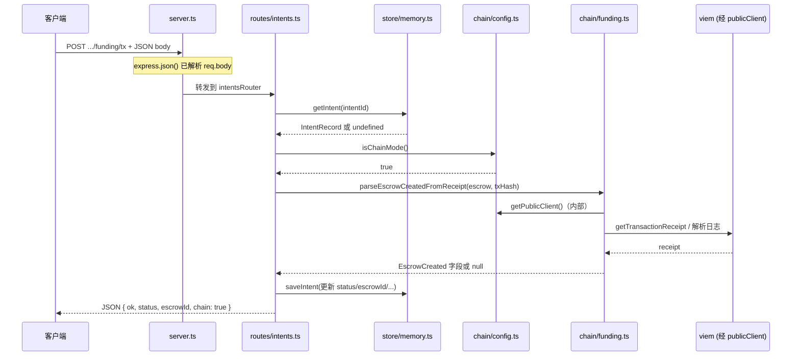

# PayFi Demo：HTTP 请求在代码中的走向

本文档描述业务 API（`PORT`，默认 `8787`）中两类典型请求如何从 `src/server.ts` 进入 Express，再落到路由与链相关模块。可与 `WORKLOG.md` 中的架构概览对照阅读。

## 相关文件

| 角色 | 路径 |
|------|------|
| 应用入口与装配 | `src/server.ts` |
| 意图与 funding/release/refund 路由 | `src/routes/intents.ts` |
| 链模式判断与 viem 客户端 | `src/chain/config.ts` |
| 充值交易回执解析 | `src/chain/funding.ts` |
| 内存态 intent 存储 | `src/store/memory.ts` |

---

## 图 1：`GET /health`

健康检查不经过 `intents` 路由；在 `server.ts` 内直接响应，并调用 `isChainMode()` 汇总当前环境是否具备链上模式所需变量。

---

## 图 2：`POST /api/payfi/v1/intents/:intentId/funding/tx`（链上模式）

请求先经全局中间件（如 `express.json()`）解析 body，再由 `server.ts` 挂载的 `intentsRouter` 处理。链上模式下会经 `parseEscrowCreatedFromReceipt` 用 RPC 拉取回执并校验 `EscrowCreated`，最后回写 `store/memory`。

---

## 备注

- 链节点 RPC（如本地 Anvil `http://127.0.0.1:8545`）由环境变量 `CHAIN_RPC_URL` 配置，经 viem 的 `http()` transport 访问；业务 HTTP 服务端口（默认 `8787`）与 JSON-RPC 端口不同。
- 若在 GitHub / VS Code 等环境预览 Mermaid，需支持 Mermaid 渲染；也可将图复制到 [Mermaid Live Editor](https://mermaid.live) 导出 PNG/SVG。
