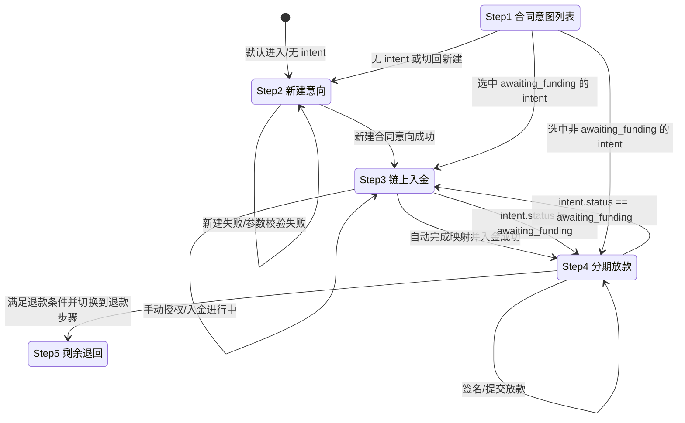

# Cross-Space PoC 设计文档（Core -> eSpace Escrow）

## 1. 目标与范围

### 1.1 路演场景（最新版）

- 场景：**上海买家**向**香港卖家**采购货物，需解决跨境交易中的信任与履约结算问题。
- 痛点：跨境收付链路复杂、对账慢、履约争议难核验。
- 目标：用 Conflux 双空间能力，提供“下单保证金 + 履约放款 + 可审计证据”的链上闭环。

### 1.2 两段实现策略（先交付、后升级）

本 PoC 分两段推进，避免在路演阶段引入过高交付风险：

1. **第一段（路演保证）**：事件映射闭环  
   Core Space 下单并触发事件 -> relayer 监听并在 eSpace 创建 escrow -> 手动/模拟签收 -> 自动放款。
2. **第二段（赛后升级）**：真实资金跨空间搬运  
   将“事件映射 + relayer 垫资”升级为“跨空间资金证明 + 到账后入托管”。

默认约束：**尽量不改现有 `PayFiEscrow.sol` 主逻辑**，以减少回归风险并保证黑客松交付节奏。

---

## 2. 角色及职责

### 2.1 最小必需角色（4 个）

- `buyer`（买家）
  - 在 Core Space 下单并支付保证金
  - 在 eSpace 侧触发签收确认（手动/模拟）
- `seller`（卖家）
  - 接单、履约（发货状态由系统或手动模拟）
  - 收取放款资金
- `projectAdmin`（项目方/管理员）
  - 合约部署、参数配置、白名单管理
  - 紧急暂停与异常处理
- `relayer`（跨空间执行账户）
  - 监听 Core 事件
  - 在 eSpace 发起创建 escrow 的链上交易
  - 维护 `coreOrderId -> escrowId` 映射

### 2.2 推荐补充角色（可选）

- `arbiter`（仲裁员）
  - 争议订单裁决（退款/强制放款）
- `sponsor`（Gas 代付账户）
  - 负责用户免 gas 场景的费用承担

---

## 3. 币种选择策略

### 3.1 推荐方案（比赛交付优先）

- 主流程：`CFX`（快速跑通、依赖少）
- 稳定币分支：`eSpace USDT`（跨境电商叙事最直观）

### 3.2 为什么优先 eSpace USDT

- 现有 `PayFiEscrow.sol` 部署在 eSpace，接入成本最低
- 对评审和业务方来说，USDT 结算语义明确
- 能保留后续扩展空间（USDC、多币白名单）

### 3.3 Core USDT 与 eSpace USDT 说明

- 它们位于不同执行空间，不可直接当同一余额使用
- 若要跨空间联动，需要事件驱动 + 映射/桥接流程

---

## 4. 可落地方案（分段实现）

## 4.0 总览：本次路演交付边界

- 路演阶段仅承诺并验收：**事件映射闭环（第一段）**。
- 真实资金跨空间搬运（第二段）在本文档中给出升级要点与难点，不作为本次路演阻塞项。

## 4.1 合约与服务改动

### A. 新增 Core 合约：`CoreOrderVault`

核心职责：

- `placeOrderDeposit(orderId, buyer, seller, token, amount)`
  - 收取保证金
  - 记录订单状态
  - 发出 `OrderDeposited` 事件

建议事件字段：

- `orderId`
- `buyer`
- `seller`
- `token`
- `amount`
- `timestamp`

### B. 新增 eSpace 适配器：`ESpaceEscrowAdapter`

核心职责：

- `createEscrowFromCore(...)`：将 Core 事件映射为 eSpace escrow 创建动作
- `confirmDeliveryAndRelease(...)`：签收后触发对 `PayFiEscrow` 的放款流程
- 防重放机制：`processedOrderId[orderId] = true`

> 说明（路演阶段）：`createEscrowFromCore` 当前仍是“事件驱动 + eSpace 侧执行入托管”的 PoC 语义，用于验证业务闭环。

### C. 新增 Relayer 服务（Node.js 脚本即可）

核心职责：

- 监听 Core 的 `OrderDeposited`
- 校验事件来源与参数白名单
- 调用 eSpace `createEscrowFromCore`
- 写入映射：`coreOrderId -> escrowId`（数据库或本地 json）

## 4.2 现有主合约改动原则

- `PayFiEscrow.sol` 主状态机不改或仅做最小接口暴露
- 通过 Adapter 封装跨空间行为，不把跨空间复杂性塞进主合约

## 4.3 第二段升级目标：真实资金跨空间搬运

从“事件映射 + relayer 垫资”升级到“资金与状态一致”的跨空间搬运，建议补齐：

1. **资产跨空间通道**：Core 侧锁定/销毁与 eSpace 侧解锁/铸造（或同等机制）。
2. **跨空间凭证绑定**：`coreOrderId` 与唯一 `transferId/messageId` 一一绑定，防重放、防串单。
3. **到账后入托管**：`createEscrowFromCore` 改为“验证跨空间到账证明后再 `registerDeposit`”。
4. **失败补偿**：超时、失败、重试、人工仲裁路径可执行并可审计。
5. **状态机扩展**：增加 `bridging / bridged / bridge_failed` 等状态，前后端统一展示。

---

## 5. 交易流

## 5.0 三个 ID 的关系与存储位置

为避免前后端与链上语义混淆，Cross-Space 流程统一使用以下三类 ID：

- `intentId`（PayFi 业务意向 ID）
  - 生成来源：后端 API 创建意向时生成（UUID）。
  - 主要存储：链下（`IntentRecord`，内存或 PostgreSQL）。
  - 链上关系：通常不直接作为链上主键；需要链上关联时通过哈希/派生方式间接绑定。
- `coreOrderId`（Core Space 订单 ID）
  - 生成来源：Core 合约 `CoreOrderVault` 下单流程（`placeOrderDeposit`）的订单编号。
  - 主要存储：链上（Core 事件与状态）；链下保存副本用于查询。
  - 链下映射：Relayer 回写 `coreOrderId -> escrowId`，用于跨空间追踪。
- `escrowId`（eSpace 托管 ID）
  - 生成来源：eSpace 侧 `ESpaceEscrowAdapter.createEscrowFromCore` / `PayFiEscrow` 创建托管实例时确定。
  - 主要存储：链上（eSpace 合约状态）；链下保存副本用于前端展示与检索。
  - 绑定关系：在业务流程推进后，可与 `intentId`、`coreOrderId` 建立一对一（或阶段性）关联。

关系图（逻辑）：

1. Core 下单得到 `coreOrderId`（链上 Core）
2. Relayer 在 eSpace 创建托管得到 `escrowId`（链上 eSpace）
3. 链下映射表记录 `coreOrderId -> escrowId`
4. 业务意向 `intentId` 在链下记录，并在后续流程中与 `escrowId` 对齐，形成 `intentId <-> escrowId <-> coreOrderId` 可追溯链路

ASCII 流程图（路演可直接引用）：

```text
[Core Space]                                  [eSpace]
 buyer                                          ESpaceEscrowAdapter --> PayFiEscrow
   |                                                    ^
   | placeOrderDeposit(...)                             | createEscrowFromCore(...)
   v                                                    |
CoreOrderVault -- emit OrderDeposited(coreOrderId) --> relayer (off-chain worker)
                                                          |
                                                          | callback: coreOrderId, escrowId
                                                          v
                                         [Off-chain] PayFi API + mapping DB
                                             - save link: coreOrderId <-> escrowId
                                             - IntentRecord(intentId, ..., escrowId?)
                                                          |
                                                          | funding / reconciliation
                                                          v
                                 bind business view: intentId <-> escrowId <-> coreOrderId
```

图例：`[Core Space]`、`[eSpace]`、`CoreOrderVault`、`ESpaceEscrowAdapter`、`PayFiEscrow` 为链上组件；`relayer (off-chain worker)`、`PayFi API`、`IntentRecord`、`coreOrderId <-> escrowId` 映射表为链下组件。

## 5.1 第一段（路演）交易流：事件映射闭环

1. `buyer` 调用 Core `placeOrderDeposit`
2. Core 链上产生日志 `OrderDeposited`
3. `relayer` 监听到事件后调用 eSpace `createEscrowFromCore`
4. eSpace 创建 escrow 成功并记录映射
5. `buyer` 手动/模拟签收（前端按钮或脚本）
6. Adapter/主合约触发 `release`
7. 资金自动放款到 `seller`

## 5.2 第二段（升级）交易流：真实资金跨空间

1. Core 侧锁定保证金并生成跨空间消息/凭证
2. 中继系统提交凭证到 eSpace
3. eSpace 校验凭证并确认到账
4. 到账校验通过后创建 escrow 并完成 `registerDeposit`
5. 后续签收、放款、退款沿用现有托管状态机

---

## 5.3 第二段主要难点（评审问答可直接引用）

- **一致性难题**：Core 已锁定但 eSpace 未到账时，如何保证可恢复。
- **非原子性**：跨空间天然异步，需两阶段确认与补偿机制。
- **防重放与幂等**：消息重复投递下保持“只入账一次”。
- **确认深度与时延**：兼顾安全性与用户体验。
- **可观测性**：双空间 tx、消息状态、escrow 映射需全链路可追溯。

---

## 6. 本地测试环境准备

## 6.1 基础环境

- Node.js 18+
- npm / pnpm（与仓库现状一致）
- Hardhat 或 Foundry（按现有仓库工具链）
- 可访问 Core/eSpace 测试网 RPC

## 6.2 钱包准备（建议新浏览器 Profile）

- 新建独立浏览器 Profile（Hackathon 专用）
- 安装 `MetaMask`（主要用于 eSpace）
- 安装 `Fluent`（主要用于 Core Space）
- 仅使用测试私钥，严禁导入主资产钱包

## 6.3 账户准备（建议 5-6 个）

- `buyer`
- `seller`
- `projectAdmin`
- `relayer`
- `arbiter`（可选）
- `sponsor`（可选）

说明：`relayer` 建议独立 EOA，避免与 admin 共用私钥。

## 6.4 Faucet 与 Gas

- Core 测试网领币：<https://faucet.confluxnetwork.org/>
- eSpace 测试网领币：<https://efaucet.confluxnetwork.org/>

部署两个空间合约时，对应发送交易账户都需要有足够 CFX 支付 gas。

---

## 7. 测试步骤（可直接执行）

## 7.1 Happy Path（必须通过）

1. Core 下单并支付保证金成功
2. Relayer 成功在 eSpace 自动创建 escrow
3. 手动/模拟签收成功
4. 自动放款成功，`seller` 余额增加
5. 两空间映射一致（`coreOrderId -> escrowId`）

## 7.2 异常与安全（建议至少 4 条）

- 重放同一 Core 事件，应被防重放拒绝
- 非白名单地址调用 Adapter，应回滚
- 金额/订单参数不一致，应拒绝执行
- 超时未履约，走退款路径成功

## 7.3 演示彩排清单

- 准备 3 个交易哈希：Core 下单、eSpace 创建、eSpace 放款
- 准备 1 个失败样例：重放攻击被拒绝
- 准备 1 张状态流转图用于答辩

## 7.4 前端步骤状态机（当前实现）

用于说明用户页 5 步向导中，与 Cross-Space 主流程直接相关的跳转规则（`新建意向 -> 链上入金 -> 分期放款`）。



补充说明：

- Conflux + Cross-Space 场景中，“展开链上入金操作（手动）”仅控制 Step3 卡片内手动操作区的折叠显示，不改变主步骤跳转。
- 当前单向规则：
  1. `onCreate` 成功后，进入 Step3（链上入金）；
  2. `onAutoMapAndFundDemo` 成功后，进入 Step4（分期放款），不回 Step2。
- **自动映射并入金（方案 A，已实现）**：若 Step3 当前已加载 **`awaiting_funding`** 的意向，则 **`onAutoMapAndFundDemo` 复用该 `intentId` 调用自动入金**，不再额外 `onCreate`，避免同一演示路径出现两条业务意向。仅当页面上无待入金意向时，才在自动流程内新建意向后再入金。

### 7.5 规划：intent 与 Core 订单强绑定（方案 C，未实现）

**背景**：当前 `cross-space-demo` 子进程使用的 **`DEMO_ORDER_ID`**（或默认 `Date.now()`）与前端 **`POST /intents`** 生成的 **`intentId`** 在链路与数据模型上**弱关联**——业务侧靠「入金成功后 `funding/tx` 按 `escrowId` 回写 `intentId`」对齐，而非下单前锁定同一业务键。

**目标（方案 C）**：

1. **触发 cross-space demo 时传入当前 `intentId`**（或专用请求体），由 API 在 `spawn` 前从 **`intentStore` 读取该意向**，将 **`amountTotal` / `amountPerLesson` / `maxReleases` / `durationSeconds` / `agreementHash`** 等注入子进程环境，与链上托管参数一致。
2. **`coreOrderId` 生成策略**（择一或组合，需评审）：  
   - 由 **`intentId` 派生**可放入 `uint256` 的确定性数值（需注意碰撞与可读性）；或  
   - 仍用时间戳/自增，但在 **`POST /intents` 创建时即写入**「预留 Core orderId」字段，demo 脚本只消费该字段。
3. **Relayer 回调** `POST .../core-links/mapped` 时携带 **`intentId`**（若尚未支持则扩展 body），使 **`payfi_core_intent_links`** 在映射写入阶段即具备 **`intent_id`**，减少「仅 escrow 侧有映射、intent 侧晚绑定」的窗口期。
4. **服务端**：扩展 `POST /api/payfi/v1/debug/cross-space/demo`（或等价路由）接受 **`intentId`**，校验 `PAYFIDEMO_DEBUG`、意向存在且状态允许后再启动 `scripts/cross-space-demo.mjs`。

**依赖与风险**：需与现有 **`DEMO_*` 环境变量**、Railway 多服务部署、以及 Core 上 **orderId 唯一性**策略对齐；改动触及 `server.ts`、intent 类型与迁移（若新增列）、`cross-space-demo.mjs`、文档与 E2E 测试。

**验收建议（未来实现时）**：同一 `intentId` 走完「Core 下单 → 映射 → eSpace 入金」后，`GET .../core-links/by-intent/:intentId` 在入金前后均具备一致可查的 `coreOrderId` / `escrowId`，且链上 Core **`orderId`** 与后端记录可追溯对应。

---

## 8. 时间估算（1 人）

- 合约新增与部署脚本：`1.0 - 1.5 天`
- Relayer 开发与映射存储：`1.0 天`
- 前端最小展示接入：`0.5 - 1.0 天`
- 测试与问题修复：`1.0 天`
- 文档与录屏彩排：`0.5 天`

总计：**4 - 5 天（稳妥）**  
压缩模式（仅 happy path）：**2.5 - 3 天**

---

## 9. MVP 交付定义（DoD）

满足以下条件即视为 **路演版（第一段）PoC** 可提交：

- 可完成 Core 下单 -> eSpace 创建 escrow -> 签收 -> 放款全链路
- 有防重放与调用权限控制
- 有最小测试报告（happy path + 至少 2 条异常）
- 有 2-3 分钟演示视频与关键 tx 哈希

第二段（真实资金跨空间）作为后续里程碑，单独验收“资金到账证明 + 状态一致性 + 失败补偿”。

