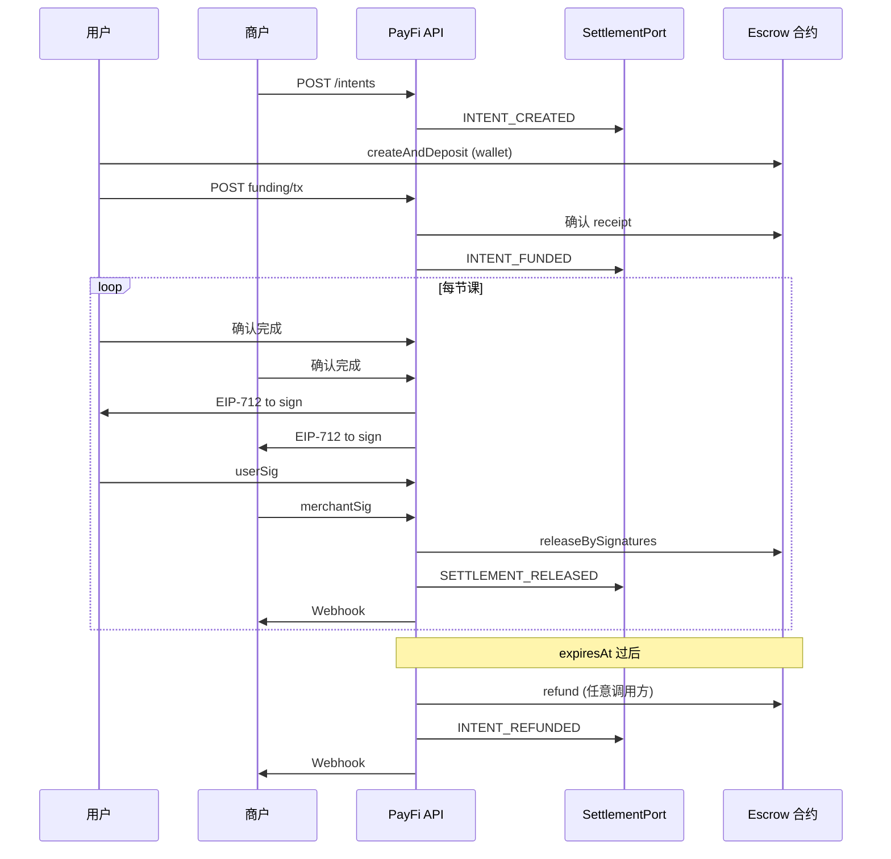

# PayFi × 托管 Escrow — 演示架构设计（payfidemo）

本文把 **链上多笔 `escrowId` 托管合约** 挂进 **PayFi 故事**：支付意图、状态同步、商户回调。面向黑客松 / 作品集演示，约定如下：

- **链上默认**：**Base 测试网**（如 Base Sepolia）部署 Escrow、使用测试 USDC（或团队选定的测试 ERC20）；RPC、水龙头与钱包工具链成熟，便于完成 payfidemo。
- **结算消息层**：代码侧为 **`SettlementPort`** + 默认 **`MockSettlementAdapter`** + 内存 **`SettlementOutbox`**（可换持久化表）；**可插拔** 对接 **HashKey Settlement Protocol（HSP）等** HTTP/SDK，不因某一家 SDK 成熟度阻塞 demo。
- **真实协议 SDK（可选）**：若需要对外展示「已接开放支付标准」，可 **并行** 集成 **[Coinbase x402](https://github.com/coinbase/x402)**（HTTP 402 + 客户端/服务端库），作为 **PayFi 技术佐证**；与 Escrow **并列演示**，不必强行把 x402 与每一笔 `release` 绑在同一交易里。

---

## 1. 一句话叙事（对外）

> **用户**在商户处购买「课包 / 里程碑服务」，通过 **PayFi 支付意图** 锁定资金；**每一节课结束后**，用户与商家在应用内各确认一次，系统校验 **双签** 后在链上 **释放一期结算**；**周期届满** 未释放部分 **自动退回用户**。商户 ERP 通过 **Webhook** 接收与 **结算消息层** 一致的「请求—确认—回执」状态；链上结算跑在 **Base 测试网**，出站事件默认经 **`SettlementOutbox`**（Mock），后续可换 **HashKey Settlement Protocol 等** 真实 adapter。可选地，用 **x402** 演示「API / 机器支付」类 PayFi 能力，作为补充叙事。

链上 escrow 是 **结算执行层**；PayFi 演示重点在 **意图 ID、状态机、幂等回调**，而不是「只有合约」。

---

## 1.1 默认链与协议栈（演示约定）

| 层级 | 默认选择 | 说明 |
|------|----------|------|
| **L2 / 链** | **Base Sepolia**（或当前官方推荐的 Base 测试网） | 合约、`chainId`、区块浏览器链接写进 README；主网仅在有明确需求时再切。 |
| **资产** | 测试网 **USDC** 或标准 **ERC20 Mock** | 与 `amountTotal` 等字段 decimals 一致即可。 |
| **结算消息层** | **Mock**：控制台 + DB（演示）`settlement_outbox` | **`SettlementPort` 实现可替换**；真实环境可接 **HashKey Settlement Protocol** 等，换 `HttpSettlementClient` / 厂商 SDK 适配器即可。 |
| **开放支付标准（佐证）** | **可选 [x402](https://github.com/coinbase/x402)** | 例如：保护某只读 API（报价、条款 PDF、intent 元数据），返回 402 → 客户端按 x402 完成支付后再访问；与 **Escrow 课包释放** 可分两条故事线演示，降低耦合。 |

**环境变量建议**：`CHAIN_ID`、`RPC_URL`、`ESCROW_ADDRESS`、`USDC_ADDRESS`、`SETTLEMENT_ADAPTER=mock|http`（示例命名，实现时与代码对齐）、`X402_ENABLED=true|false`。

---

## 2. 概念对照

| 概念 | 职责 | 备注 |
|------|------|------|
| **Payment Intent（支付意图）** | 业务侧订单：谁付、谁收、总额、单笔释放额、次数、周期 | 链下主记录；可与经 **`SettlementPort`** 发出的消息一一对应（Mock 时本地生成） |
| **`intentId`** | UUID 或 `bytes32`，全系统主键 | API、Webhook、UI 都用它 |
| **`escrowId`** | 链上 `uint256` | 创建托管成功后写入意图 |
| **SettlementAdapter** | 把内部状态变化 **映射为** 出站结算事件（开放协议 / 厂商 HTTP / 或仅日志） | **默认 `MockSettlementAdapter`**；**可插拔** 真实实现；SDK 不足时不阻塞，链上仍在 Base 测试网完成 |
| **x402（可选）** | HTTP **402 Payment Required** + 官方多语言 SDK，常用于 API / Agent 付费 | **并行** 接入作 PayFi 佐证；与 Escrow 解耦，见 §1.1 |
| **Settlement（结算）** | 单笔 `release`：双签 + 链上转账给商户 | 与「一节课 / 一里程碑」对齐 |
| **合同锚点（Contract anchor）** | 用 **哈希 + 版本号** 把支付意图绑到「当时约定的那版条款」，不存全文上链 | 轻量：不替代律师合同，只增强可追溯性 |

---

## 2.1 合同锚点（轻量工程）

目标：**不存 PDF 上链**，只在系统里固定「双方认的是哪一版约定」，并在 **每次释放的双签** 里带上同一锚点，避免「事后换条款说不清」。

### 字段（创建意图时写入）

| 字段 | 类型 | 必填 | 说明 |
|------|------|------|------|
| `agreementHash` | `bytes32`（0x 前缀 66 字符） | 建议必填 | 条款内容的密码学承诺（见下「怎么算」） |
| `termsVersion` | `string` | 建议必填 | 人类可读版本，如 `1.0.0`；与 `agreementHash` 一起在 UI 展示 |
| `termsUri` | `string`（URL） | 可选 | 条款托管地址（IPFS/https）；**以哈希为准**，URL 仅方便下载核对 |
| `jurisdiction` | `string` | 可选 | 如 `Hong Kong`；演示用，无法律效力声明 |
| `disputeResolver` | `string` | 可选 | 预留：未来仲裁机构 / 模块地址描述；MVP 可空 |

### `agreementHash` 怎么算（演示选一种，写进 README 固定）

**推荐 A：规范化 JSON（最易脚本复现）**

对以下对象做 **UTF-8 JSON 序列化**（键名排序、无多余空格、固定字段顺序），再 `keccak256(bytes)`：

```json
{
  "title": "10-lesson pack escrow",
  "termsVersion": "1.0.0",
  "amountTotal": "1000000000",
  "amountPerLesson": "100000000",
  "maxReleases": 10,
  "durationSeconds": 2592000,
  "merchant": "0x...",
  "user": "0x..."
}
```

**推荐 B：文件哈希**

若条款是 PDF：对文件 **原始字节** `keccak256(pdfBytes)`（或改用 SHA-256 再在链下记 `sha256:` 前缀；EIP-712 里仍用 `bytes32` 承载约定好的算法标识，**MVP 统一 Keccak 即可**）。

### 绑定到双签（EIP-712）

在 **`Release` 的 typed data `message` 中增加**：

- `agreementHash: bytes32`
- `termsVersion: string`

双方每次签 **本节课释放** 时，都包含 **同一锚点**，则链下可证明：「该次结算是在某版条款承诺下同意的」。

### 与链上 Escrow 的关系（两档）

| 档位 | 做法 | 适用 |
|------|------|------|
| **MVP** | 合约 **只验** `escrowId / nonce / amount / merchant`；**合同锚点仅在 EIP-712 + 链下存储**。证据在签名与数据库。 | 最少改合约、最快演示 |
| **加强** | 合约 `release` 的 typed hash **增加** `agreementHash`（`termsVersion` 可不进链以省 gas），链上校验与链下一致。 | 需改合约并重新部署 |

演示默认 **MVP 档**；文档与接口仍按 **加强档** 预留字段，便于升级。

### 非法律声明

合同锚点是 **工程上的完整性工具**，不自动构成任何法域下的「完整合同」；正式业务需独立法务文件。

---

## 3. 系统组件

```
┌─────────────┐     ┌──────────────────┐     ┌─────────────────┐
│  Web / dApp │────▶│  PayFi API       │────▶│ MockSettlementAdapter │
│  (用户/商户) │     │  (Node/Next)     │     │ (可插拔真实协议)   │
└──────┬──────┘     └────────┬─────────┘     └────────┬────────┘
       │                     │                        │
       │              (可选) x402 中间件 / facilitator │
       │                     │                        │
       │                     │  读签名、拼 calldata    │
       │                     ▼                        ▼
       │              ┌──────────────┐         ┌──────────────┐
       └─────────────▶│ Escrow 合约   │         │ Webhook 投递  │
         wallet       │ Base 测试网    │         │ (商户 URL)    │
                      │ (多 escrowId) │         └──────────────┘
                      └──────────────┘
```

- **PayFi API**：权威状态机、存储 `intents`、触发 Webhook、可选代提交链上 tx（或返回 data 由前端发）。
- **`MockSettlementAdapter`**（默认）：实现 **`SettlementPort.emit(kind, payload)`** → 写内存 **`SettlementOutbox`** + 控制台；**不调用外网**；真实协议就绪后换实现类即可（**同一 `SettlementPort` 接口**）。
- **x402（可选）**：在独立路由或服务上启用，用于「付费再访问」的 API；详见 §1.1 与 §14。
- **Escrow 合约**：**默认部署于 Base 测试网**；`createAndDeposit`、`releaseBySignatures`、`refund`、`IDisputeModule` 占位。

---

## 4. 支付意图状态机（链下 / API 层）

与链上状态 **松耦合**：链下可超前；以链上结果为 **资金真相**。

| 状态 | 含义 | 典型下一跳 |
|------|------|------------|
| `draft` | 仅创建记录，未充值 | `awaiting_funding` |
| `awaiting_funding` | 等待用户链上 `deposit` 成功 | `active` |
| `active` | 托管有余额、未过期、可释放 | `partially_settled` / `refunded` |
| `partially_settled` | 至少成功一次 `release` | `settled` / `refunded` |
| `settled` | `releasedTotal == amountTotal` | 终态 |
| `refunded` | 到期 `refund` 成功 | 终态 |
| `expired`（可选） | 仅时间到、尚未链上 `refund` | 触发提醒 → `refunded` |

**规则建议**：

- 仅在 **链上 `Deposit` 交易确认** 后，才把意图设为 `active`（ indexer 或前端回传 tx hash 后 API `confirmFunding`）。
- 每次链上 `Released` 事件确认后，更新 `releasedCount`、`releasedTotal`，并发 **Webhook**。
- 链上 `Refunded` 确认后 → `refunded`。

---

## 5. 结算事件（`SettlementOutbox` / Mock 映射）

不绑定某一开放协议字段名；用下列 **事件 kind** 对齐 PayFi 叙事，便于以后替换为 **HashKey Settlement Protocol 等**：

| 内部事件 | 开放结算协议类比 | 说明 |
|----------|----------|------|
| `INTENT_CREATED` | Payment **Request** | 商户侧「要价」：金额、周期、收款方 |
| `INTENT_FUNDED` | **Confirm**（资金到位） | 用户完成 `deposit` |
| `SETTLEMENT_RELEASED` | **Receipt** / 结算回执 | 单笔释放成功 |
| `INTENT_REFUNDED` | **Receipt**（关闭） | 剩余退回用户 |

每条消息带：`intentId`, `escrowId`, `timestamp`, `eventId`（UUID，Webhook 幂等键），以及 **`agreementHash` / `termsVersion`**（与 §2.1 一致）。

---

## 6. `intentId` ↔ `escrowId`

- 用户点击「创建课包」→ API 生成 `intentId`，写库 `status=draft`。
- 用户准备充值 → 返回 **链上 `createAndDeposit` 的 calldata + 合约地址**；或 API 代发（需 relayer 密钥，演示可省略）。
- 交易确认后 API 解析 **日志或事件** 得到 `escrowId`，更新 `escrows.intent_id = intentId`。

**唯一约束**：DB 里 `(intentId → escrowId)` 一对一。

---

## 7. REST API（演示最小集）

路径前缀示例：`/api/payfi/v1`。

### `POST /intents`

创建支付意图（商户或平台代建）。

**Body（示例）**

```json
{
  "merchant": "0x...",
  "user": "0x...",
  "asset": "0x...",
  "amountTotal": "1000000000",
  "amountPerLesson": "100000000",
  "maxReleases": 10,
  "durationSeconds": 2592000,
  "webhookUrl": "https://merchant.example/hooks/payfi",
  "agreementHash": "0x0123...abcd",
  "termsVersion": "1.0.0",
  "termsUri": "https://example.com/terms/lesson-pack-v1.pdf",
  "jurisdiction": "Hong Kong",
  "disputeResolver": ""
}
```

**Response**：`{ "intentId": "uuid", "status": "awaiting_funding" }`  
副作用：经 `SettlementPort` 写入 `INTENT_CREATED`（Mock 入 `SettlementOutbox`）。

---

### `POST /intents/:intentId/funding/tx`

用户已广播充值 tx 后上报（或 indexer 回调）。

**Body**：`{ "txHash": "0x..." }`  
**行为**：校验 receipt → 读 `escrowId` → `status=active`。`SettlementPort`：`INTENT_FUNDED`。

---

### `POST /intents/:intentId/release/prepare`

双方已在 UI 点「确认本节课完成」后，由后端校验链下业务条件，生成 **EIP-712 typed data** 给双方签名。

**Response**：

```json
{
  "domain": { "name": "...", "version": "1", "chainId": 84532, "verifyingContract": "0x..." },
  "types": { "Release": [...] },
  "message": {
    "escrowId": "1",
    "nonce": "0",
    "amount": "100000000",
    "merchant": "0x...",
    "agreementHash": "0x0123...abcd",
    "termsVersion": "1.0.0"
  }
}
```

`agreementHash` / `termsVersion` **必须与** `GET /intents/:intentId` 中存储的一致，否则 API 应拒绝 `release/submit`。

`chainId` 与默认链一致：演示用 **Base Sepolia 为 `84532`**（若切换网络需同步改环境变量与合约部署地址）。

---

### `POST /intents/:intentId/release/submit`

**Body**：`{ "userSig": "0x", "merchantSig": "0x" }`  
**行为**：调用合约 `releaseBySignatures`（服务端带 `relayer` 或返回 raw tx 给前端）。成功后 **`SettlementOutbox` / Webhook** `SETTLEMENT_RELEASED`。

---

### `POST /intents/:intentId/refund`

**行为**：仅当 `block.timestamp >= expiresAt`；调 `refund(escrowId)`。Webhook `INTENT_REFUNDED`。

---

### `GET /intents/:intentId`

返回意图 + 链上同步字段（`escrowId`, `releasedTotal`, `expiresAt`, `status`）+ 合同锚点字段（`agreementHash`, `termsVersion`, `termsUri`, `jurisdiction`, `disputeResolver`）。

---

## 8. Webhook 投递（与 `payment-flow-idempotency-replay-clock-skew.md` 对齐）

### 请求

- `POST merchant.webhookUrl`
- Header：`X-PayFi-Event-Id`（= `eventId`，幂等键）、`X-PayFi-Signature`（HMAC-SHA256，密钥商户在创建意图时可选填）、`X-PayFi-Timestamp`

### Body（示例：`SETTLEMENT_RELEASED`）

```json
{
  "type": "SETTLEMENT_RELEASED",
  "eventId": "uuid",
  "intentId": "uuid",
  "escrowId": "1",
  "amount": "100000000",
  "releaseIndex": 3,
  "txHash": "0x...",
  "createdAt": "2026-03-20T12:00:00Z",
  "agreementHash": "0x0123...abcd",
  "termsVersion": "1.0.0"
}
```

`INTENT_CREATED` / `INTENT_FUNDED` / `INTENT_REFUNDED` 的 payload 同样附带 `agreementHash` 与 `termsVersion`，便于商户 ERP 与内部合同系统对账。

### 商户侧约定

- 以 `eventId` **去重**；重复投递返回 200 即可。
- 校验时间戳窗口防 **重放**（见同目录幂等文档）。

---

## 9. 端到端时序（Mermaid）



---

## 10. 数据表（逻辑模型，演示可用 SQLite/JSON）

**`intents`**

- `intent_id`, `user`, `merchant`, `asset`, `amount_total`, `amount_per_lesson`, `max_releases`, `expires_at`, `escrow_id`, `status`, `webhook_url`, `webhook_secret`, `created_at`
- **合同锚点**：`agreement_hash`, `terms_version`, `terms_uri`, `jurisdiction`, `dispute_resolver`（后三项可空）

**`webhook_deliveries`**（可选，用于演示重试）

- `event_id` (PK), `intent_id`, `payload_json`, `status`, `attempts`, `last_error`

**`settlement_outbox`**（可选，演示「消息层」）

- `id`, `intent_id`, `kind`, `payload_json`, `created_at`

---

## 11. 与链上 Escrow 的衔接点

- 合约 `Release` 的 EIP-712 `domain.verifyingContract` **必须** 与 API 返回一致。
- `message` 含 `escrowId`, `nonce`（= 合约 `releaseNonce`）, `amount`, `merchant`；**并含** `agreementHash`, `termsVersion`（链下签名完整性；**MVP 链上可不验**，见 §2.1）。
- 第一版可 **固定 `amount == amountPerLesson`**；最后一笔若扫尾，需在 `prepare` 里读链上 `remaining` 动态填入 message。

---

## 12. MVP 裁剪（建议）

| 做 | 暂缓 |
|----|------|
| **Base 测试网** + 单 ERC20（测试 USDC 或 Mock） | 多链、主网 |
| **`MockSettlementAdapter`** + `SettlementOutbox` + 文档声明可插拔 | 真实 **HashKey Settlement Protocol 等** HTTP（待 SDK/文档就绪） |
| （可选）**x402** 保护 1～2 个只读 API 作 PayFi 佐证 | 完整 x402 产品化与多 facilitator |
| 单链 + 一种 ERC20 | 多代币路由 |
| 用户/商户各在网页连钱包签名 | Gasless meta-tx |
| 基础 HMAC Webhook | 商户注册中心 |
| 合同锚点字段 + EIP-712 扩展 | 链上校验 `agreementHash` |
| `IDisputeModule` 恒 no-op | 仲裁流程 |

---

## 13. 文档索引

- 幂等 / 重放 / 时钟：**[payment-flow-idempotency-replay-clock-skew.md](./payment-flow-idempotency-replay-clock-skew.md)**

---

## 14. 可插拔结算层（`SettlementPort`）与并行 x402

### 14.1 本仓库的 `SettlementPort`（与扩展形态）

payfidemo **当前** 使用窄接口（与 `src/settlement/settlementPort.ts` 一致），通过 **event kind + payload** 出站：

```ts
export type SettlementEventKind =
  | "INTENT_CREATED"
  | "INTENT_FUNDED"
  | "SETTLEMENT_RELEASED"
  | "INTENT_REFUNDED";

export interface SettlementPort {
  emit(kind: SettlementEventKind, payload: unknown): string;
}
```

**兼容 HashKey Settlement Protocol 等实现**：新增适配器类（例如 `HashKeySettlementAdapter`）实现同一 `SettlementPort`，在 `emit` 内把 `kind`/`payload` **映射为** 对方 HTTP/SDK 的请求体；失败时写入持久化 **`settlement_outbox`** 做重试。

若希望更细粒度的应用 API，也可在同一适配器内封装为显式方法（等价于多路由到 `emit`）：

```ts
/** 合同锚点：所有通知可携带，便于开放协议 / ERP 对账 */
interface AgreementAnchor {
  agreementHash: `0x${string}`;
  termsVersion: string;
  termsUri?: string;
  jurisdiction?: string;
  disputeResolver?: string;
}

interface PayFiSettlementPort {
  notifyIntentCreated(intent: IntentPayload & AgreementAnchor): Promise<void>;
  notifyFunded(intentId: string, txHash: string, anchor: AgreementAnchor): Promise<void>;
  notifyReleased(intentId: string, detail: ReleasePayload & AgreementAnchor): Promise<void>;
  notifyRefunded(intentId: string, detail: RefundPayload & AgreementAnchor): Promise<void>;
}
```

链上 Escrow **部署仍默认 Base 测试网**，合约接口 **不必** 为换结算适配器而改；生产上要审计 **谁有权调 `release`** 是否与协议侧确认一致（**oracle / relayer 规则** 超出本 demo 范围）。

**厂商 SDK 未就绪时**：保持 **`MockSettlementAdapter` + `SettlementPort`**，交付物仍完整；对外说明「消息层可切换」即可。

### 14.2 并行 x402（PayFi 技术佐证）

当需要 **成熟开源 SDK** 支撑叙事时，并行引入 **[coinbase/x402](https://github.com/coinbase/x402)**（见官方文档与示例）：

- **典型用法**：某路由在未支付时返回 **HTTP 402** 与支付挑战；客户端用 x402 SDK 完成支付后携带凭证重试，服务端验证后返回资源。
- **与 Escrow 的关系**：推荐 **解耦**——例如 x402 用于「拉取课包条款 PDF / 定价元数据 / 内部报价 API」，Escrow 仍管 **资金托管与分次释放**；演示时两条路径均在 **Base** 生态内叙述更连贯。
- **开关**：用环境变量或配置启用/禁用 x402 路由，避免本地开发强依赖 facilitator。

### 14.3 链迁移（若未来必须）

若后续要求 **HashKey Chain** 等，仅须：**重新部署 Escrow**、更新 `chainId` / RPC / 浏览器链接；**PayFi API 状态机与 Webhook 模型可保持不变**；**`SettlementPort` 实现** 与 x402 仍通过各自适配层切换。
