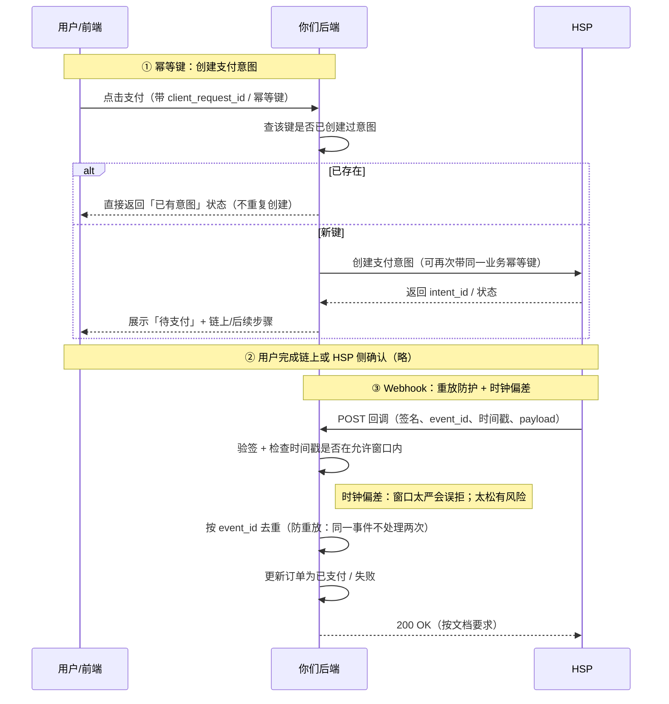

# 支付流程中的幂等键、重放与时钟偏差

面向 PayFi / HSP / Webhook 集成的入门说明：三个概念分别是什么，以及它们在「用户支付 → 后端 → HSP → 回调」里出现在哪一步。

---

## 一、三个概念（直觉版）

### 幂等键（Idempotency Key）

**含义**：同一个业务操作，因**连点、网络重试**被提交了多次时，服务器应只当作**一次**处理，避免重复扣款、重复下单。

**做法**：客户端在「创建支付 / 下单」时携带一个**随机且唯一**的 ID（幂等键）。服务端先查：这个 ID 是否已处理过？

- 已处理过 → **直接返回上次结果**，不再执行扣款或创建第二笔意图。
- 未处理 → 正常执行，并记录该 ID。

**类比**：咖啡店订单号 `#9527` 已做过一杯美式，店员不会再做第二杯，只把已做好的递给你。

### 重放（Replay）

**含义**：攻击者或故障方把**曾经合法**的请求**原样再发一遍**，企图让系统再执行一次（例如再付一次、再领一次权益）。

**与幂等的区别**：

- **幂等**：多为**己方**重复提交，系统应**温和地合并为一次**正确结果。
- **重放**：旧请求被**再次使用**，从安全角度**不应**再产生效力。

**常见防护**：nonce（一次性序号）、**时间戳 + 短有效期**、请求/回调**签名**、Webhook 用 **event_id 去重**（同一事件只处理一次）。

**类比**：昨天的电影票二维码今天再刷，应被拒（已核销或已过期）。

### 时钟偏差（Clock Skew）

**含义**：用户设备、你的服务器、HSP 服务器之间的**系统时间不一致**。若协议规定「请求 5 分钟内有效」，一方快、一方慢会导致：**刚发的请求被误判过期**，或**本该过期的仍被接受**。

**常见应对**：服务器用 NTP 校时；校验时间戳时**留合理窗口**（如 ±2～5 分钟，视安全要求而定）；日志同时记录**收到时间**与**载荷内时间戳**便于排查。

**类比**：两人对表差 10 分钟，约「整点见」时会一个说迟到、一个说早到。

---

## 二、一句话串起来

| 概念     | 解决什么问题 |
|----------|----------------|
| **幂等键** | 防止**重复提交**导致重复扣款/重复创建意图。 |
| **防重放** | 防止**旧请求/旧回调**被再利用骗系统。 |
| **时钟偏差** | 防止因**时间对不齐**让「有效期 / 防重放」误杀或误放行。 |

---

## 三、极简流程里的角色

- **用户 / 前端**：发起支付、连接钱包或确认。
- **你们后端**：创建订单、调用 HSP、校验 Webhook。
- **HSP**：支付/结算消息与状态（具体以官方文档为准）。

---

## 四、时序图（含标注）

---

## 五、步骤与三个概念的对应表

| 步骤 | 发生什么 | 幂等键 | 重放 | 时钟偏差 |
|------|----------|--------|------|----------|
| **1. 用户点支付** | 前端把「我要付这笔」发给后端 | 同一幂等键重试时，后端不**重复创建**支付意图 | 若接口暴露且无鉴权，需另防伪造（鉴权、CSRF 等） | 通常不敏感 |
| **2. 后端 → HSP** | 创建意图、查询状态 | 若 HSP API 支持，请求侧可带幂等键，避免重发产生双重意图 | 依赖 HTTPS、服务端鉴权及 HSP 侧 nonce/幂等设计 | 若请求含过期时间戳，**你们与 HSP** 时钟需大致同步 |
| **3. HSP → Webhook** | 通知支付成功/失败 | 常配合订单号 + **事件只处理一次**（处理两遍结果不变） | **event_id / delivery id 去重** + **签名**，防旧回调重播 | 验签若带 timestamp 有效期，**双方时钟差过大**可能误拒合法回调 |

---

## 六、小白版一句话（流程视角）

1. **幂等键**：从用户点击到向 HSP **创建**意图，保证连点/重试**不会开出两笔同样的单**。
2. **重放**：回调到达后，用**签名 + 事件 ID 只认一次**，防止有人把旧的成功通知再发一遍骗你们履约。
3. **时钟偏差**：凡写「几分钟内有效」的，都要考虑**两台机器表不准**会导致误拒或误放行；需校时并合理设置窗口。

---

## 七、后续

若 HSP 文档中有具体字段名（如 `idempotency-key`、`requestId`、`event_id` 等），可将本文第三节图中的占位名称替换为与实现一致的命名。
