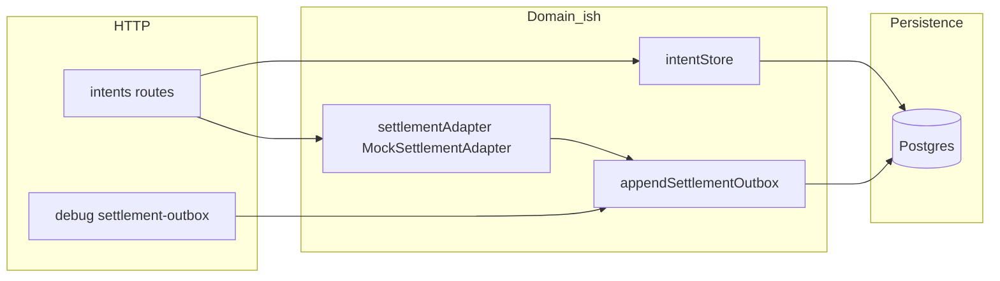
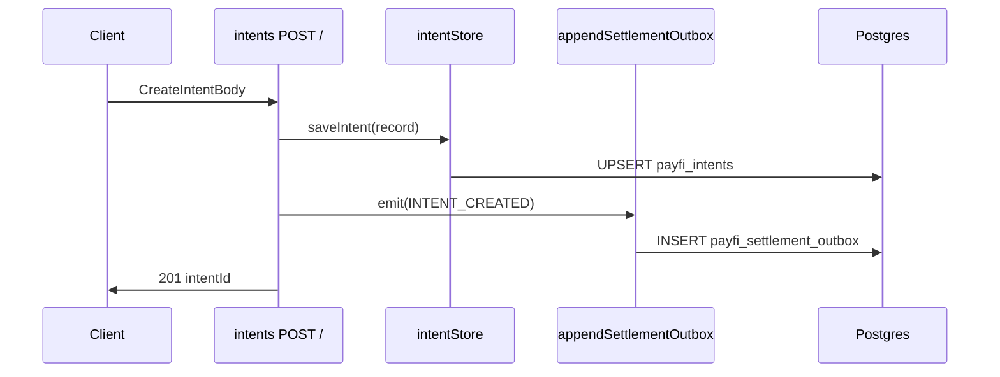
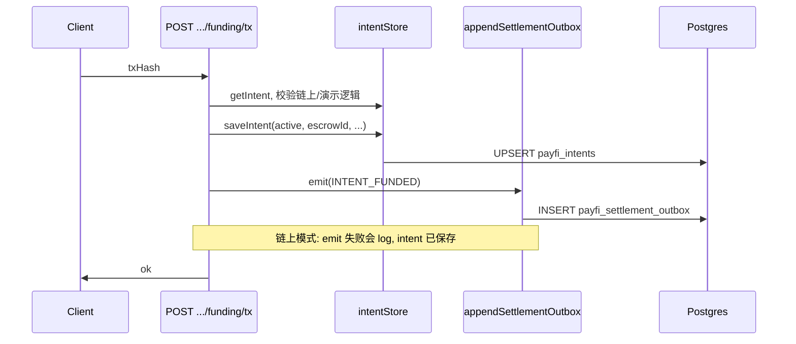

# PayFIDemo：Postgres 持久化设计（演示阶段）

本文描述在设置 `DATABASE_URL`（如 Neon）时的**数据结构、与应用层的接口、一致性边界**，以及演示用的**数据流**。实现以当前代码为准。

---

## 1. 启用方式与脚手架

| 项 | 说明 |
|----|------|
| 开关 | 环境变量 `DATABASE_URL` 非空即视为启用 Postgres；否则 intent 与 settlement outbox 均在内存中。 |
| 建表 | 进程启动时执行 `runMigrations()`（`src/db/migrate.ts`），`CREATE TABLE IF NOT EXISTS`，可重复运行。 |
| 连接池 | `src/db/pool.ts`：`pg.Pool`，`max: 10`。 |
| 健康检查 | `GET /health` 字段 `persistence` 为 `postgres` 或 `memory`。 |

---

## 2. 数据库结构

### 2.1 `payfi_intents`

| 列 | 类型 | 说明 |
|----|------|------|
| `intent_id` | `TEXT` | 主键；对应应用内 `IntentRecord.intentId`（UUID）。 |
| `payload` | `JSONB` | **整条** `IntentRecord` 的 JSON 快照（商户、用户、金额、状态、`anchor`、链上关联字段等）。 |
| `updated_at` | `TIMESTAMPTZ` | 默认 `now()`；`saveIntent` 时更新为 `now()`。 |

索引：`idx_payfi_intents_updated`（`updated_at DESC`），用于列表按时间倒序。

**设计取舍（演示）**：不按字段拆表，便于快速迭代；约束与业务规则主要在应用层与 `IntentRecord` 类型上体现。

### 2.2 `payfi_settlement_outbox`

| 列 | 类型 | 说明 |
|----|------|------|
| `id` | `UUID` | 主键；应用生成（`randomUUID()`）。 |
| `kind` | `TEXT` | 事件类型，见下节 `SettlementEventKind`。 |
| `payload` | `JSONB` | 事件负载（结构与路由里 `emit` 传入对象一致）。 |
| `created_at` | `TIMESTAMPTZ` | 插入时间，默认 `now()`。 |

索引：`idx_payfi_outbox_created`（`created_at DESC`）。

**语义**：追加型**事件日志**（append-only）；演示阶段不入队消费，仅写入并可通过 Debug API 读取。

### 2.3 `payload` 与 TypeScript 的对应关系

- **Intents**：`payload` 反序列化为 `IntentRecord`（`src/types.ts`）：`intentId`、`merchant`、`user`、`asset`、金额字段、`anchor`、`status`、`escrowId`、`fundingTxHash`、`releaseCount`、`releasedTotal`、`expiresAt`、`releaseNonce`、`createdAt` 等。
- **Outbox**：`kind` 为下列之一（`src/settlement/settlementPort.ts`）：

  - `INTENT_CREATED`
  - `INTENT_FUNDED`
  - `SETTLEMENT_RELEASED`
  - `INTENT_REFUNDED`

---

## 3. 与其它层的接口

### 3.1 Intent 存储抽象

**模块**：`src/store/intentStore.ts`

| 方法 | Postgres 实现 | 行为 |
|------|----------------|------|
| `getIntent(intentId)` | `src/store/postgresIntent.ts` | `SELECT payload WHERE intent_id = $1` |
| `saveIntent(record)` | 同上 | `INSERT ... ON CONFLICT (intent_id) DO UPDATE`（整份 `payload` 替换 + `updated_at`） |
| `listIntents()` | 同上 | `ORDER BY updated_at DESC`，返回 `payload[]` |

路由层（`src/routes/intents.ts`）**只依赖** `intentStore`，不直接访问 `pg`。

### 3.2 Settlement Outbox

**模块**：`src/settlement/settlementOutbox.ts`

| 函数 | Postgres 实现 | 行为 |
|------|----------------|------|
| `appendSettlementOutbox(kind, payload)` | `src/settlement/postgresOutbox.ts` | `INSERT` 一行 |
| `getSettlementOutbox(limit)` | 同上 | 按 `created_at DESC` 取最近 `limit` 条，再反转为时间正序 |

**适配器**：`src/settlement/mockSettlementAdapter.ts` 实现 `SettlementPort.emit`，内部调用 `appendSettlementOutbox`。

**对外调试**：`GET /api/payfi/v1/debug/settlement-outbox`（及别名的 `debug/hsp-outbox`）返回最近事件列表。

### 3.3 依赖关系简图

---

## 4. 事务与一致性（演示阶段）

### 4.1 单语句原子性

- 单次 `saveIntent`（upsert）与单次 `appendSettlementOutbox`（insert）在 PostgreSQL 中各自是**原子的**。
- 单 intent 行上的并发更新未做版本列或 `SELECT FOR UPDATE`；演示并发同一 intent 时**以后写为准**（last write wins）。

### 4.2 跨表（intent + outbox）非单事务

当前实现中，路由在多数流程里是：

1. `await intentStore.saveIntent(row)`
2. `await settlementAdapter.emit(...)` → `appendSettlementOutbox(...)`

两步使用连接池的**独立查询**，**没有**包在同一个 `BEGIN`/`COMMIT` 里。因此：

- 可能出现 **intent 已持久化，但 outbox 写入失败**（例如链上 `funding/tx` 分支里对 `emit`/webhook 有 try/catch，失败会打日志，但 intent 已为 funded）。
- 可能出现 **outbox 有一条事件，而读者若只靠 DB 会与 intent 核对时需接受短暂不一致**（演示里通常以 intent 表为准）。

**演示阶段的定位**：优先保证 **intent 状态可恢复、可列表**；outbox 作为**旁路审计/对接 HSP 的占位**，允许与 intent 在极端错误下短暂不齐。

### 4.3 若要 production 级「状态 + 事件」一致

后续可演进方向（非当前代码）：

- 在同一 **client 事务**中顺序执行 upsert + insert outbox；或
- **Transactional outbox**：只在与业务同一事务写 outbox，由独立 worker 投递；失败可重试。

---

## 5. 演示阶段最简数据流

### 5.1 创建 intent

### 5.2 确认 funding（入账后）

### 5.3 Release / Refund（同理）

- 先更新链上或演示逻辑，再 `saveIntent`，再 `emit(SETTLEMENT_RELEASED | INTENT_REFUNDED)`，同样为两步持久化。

### 5.4 读取路径

| 操作 | 数据来源 |
|------|----------|
| 列表 / 详情 intent | `payfi_intents.payload` |
| Debug 看 settlement 事件 | `payfi_settlement_outbox` |

---

## 6. 运维提示（Neon 等）

- 首次部署：配置 `DATABASE_URL`，重启 API，确认日志中有 Postgres 启用提示，且 `GET /health` 中 `persistence` 为 `postgres`。
- 轮换密码后更新 `DATABASE_URL`。
- 演示库可无备份策略；若同一库长期使用，可按 Neon 控制台做分支/恢复。

---

## 7. 源码索引

| 主题 | 路径 |
|------|------|
| DDL / 迁移 | `src/db/migrate.ts` |
| 连接池 | `src/db/pool.ts` |
| Intent CRUD | `src/store/postgresIntent.ts` |
| Store 选择 | `src/store/intentStore.ts` |
| Outbox CRUD | `src/settlement/postgresOutbox.ts` |
| Outbox 门面 | `src/settlement/settlementOutbox.ts` |
| HTTP 与持久化调用 | `src/routes/intents.ts` |
| 启动迁移 | `src/server.ts` |
