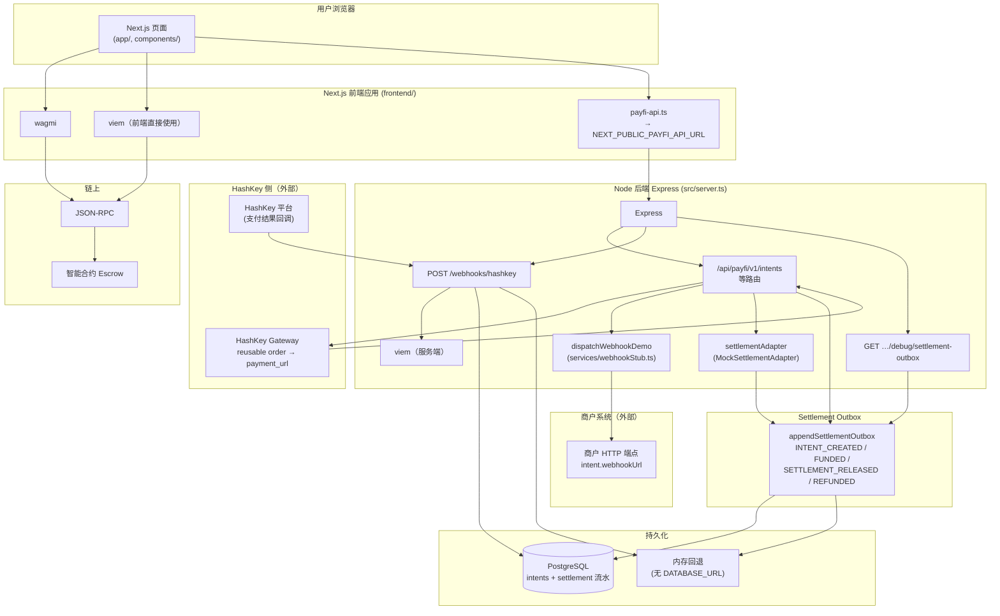

# payfidemo 系统架构：Next.js、wagmi、viem、API、持久化与外部集成

本文描述仓库中**实际进程与模块**之间的关系：前端（Next + wagmi + viem）、Node 后端（Express + viem）、链上合约、PostgreSQL、HashKey Gateway / Webhook、商户 Webhook，以及 **Settlement Outbox**。

与 **托管业务与合约层** 的概念说明见 [`payfi-escrow-architecture.md`](./payfi-escrow-architecture.md)。

**交互式总览图**（与 [`payfidemo_flow_en.html`](./payfidemo_flow_en.html) 相同模式：全览 / 分层步进 / 对比）：在浏览器中打开 [`payfidemo_architecture_overview_en.html`](./payfidemo_architecture_overview_en.html)。

---

## 1. 总览图

---

## 2. 各部分职责

### 2.1 用户浏览器中的 Next.js（前端）

- **作用**：渲染演示 UI（如托管创建、入金、双签释放、退款），发起对 **Express API** 的 HTTP 请求，并通过 **wagmi** 连接钱包、与链交互。
- **代码位置**：`frontend/app/`、`frontend/components/`（含 `providers.tsx` 挂载 `WagmiProvider`）。

### 2.2 wagmi

- **作用**：在 React 内提供 **钱包连接、切链、写合约、签名（含 EIP-712）** 等 Hooks；底层客户端与类型与 **viem** 一致。
- **与其它部分**：仅运行在浏览器侧；通过 **JSON-RPC** 访问节点（与 `NEXT_PUBLIC_*_RPC` 等环境变量一致时，与后端「看的链」对齐）。

### 2.3 viem（前端）

- **作用**：除 wagmi 隐式使用外，页面还直接 import **ABI 常量、parseUnits/formatUnits、`PublicClient.waitForTransactionReceipt`** 等。
- **与其它部分**：与 **智能合约** 通过同一 **RPC** 通信；与 **Express** 无直连，业务状态以 API 为准。

### 2.4 payfi-api.ts（前端 → 后端）

- **作用**：将 `NEXT_PUBLIC_PAYFI_API_URL`（默认 `http://127.0.0.1:8787`）拼成 **`/api/payfi/v1`** 下的 REST 调用（创建 intent、入金确认、释放、退款、**网关对账**等）。
- **与其它部分**：**Next 与 Express 分属不同进程**（典型：`next dev` 与 `npm run dev` 各占用端口）；持久化与链上副作用发生在 **Express** 内。

### 2.4.1 支付回跳页（`/payment/result`）与托管登记

- **作用**：用户经 **HashKey 收银台**（或其它路径）支付完成后，浏览器回跳到 **`{BASE_URL}/payment/result?intentId=…`**（下单时由后端 **`redirect_url`** 写入，见 `src/hashkey/client.ts` 的 **`appendIntentIdToRedirectUrl`**；若配置 **`HASHKEY_REDIRECT_URL`** 则优先使用该根地址）。
- **交易哈希**：落地页优先从 **URL query**（`tx_hash`、`transaction_hash` 等，见 `frontend/lib/payment-result-tx.ts`）解析链上哈希并 **`POST .../funding/tx`**；若 query 无哈希，则请求 **`GET .../intents/:id/gateway-reconciliation`**，由服务端调用 HashKey **`GET /merchant/payments`** 解析 **`tx_signature`** 等后再登记。
- **代码位置**：`frontend/app/payment/result/`、`frontend/lib/payment-result-tx.ts`；对账逻辑与 `src/hashkey/client.ts` 中 **`resolveGatewayTxForReconciliation`** 等一致。

### 2.5 链上：JSON-RPC 与智能合约

- **作用**：**Escrow** 等合约承载资金托管与释放；浏览器与后端均可通过 viem 连接 RPC。
- **与其它部分**：前端经 wagmi/viem；后端在 `src/chain/`、`src/routes/intents.ts` 等使用 **服务端 viem** 读合约、发交易（如配置 `CHAIN_RPC_URL`、托管合约地址）。

### 2.6 Express API（`src/server.ts`）

- **作用**：业务 API 的**唯一主入口**（非 Next Route Handler）：CORS、JSON、`/api/payfi/v1/intents` 子路由、`/webhooks`、静态资源等。
- **与其它部分**：读写 **intent 存储**（PostgreSQL 或内存）；协调 **HashKey**、**Settlement Outbox**、**商户 Webhook**、**viem 链上操作**。

### 2.7 HashKey Gateway

- **作用**：后端调用 HashKey **商户下单 API**（如 **`HASHKEY_BASE_URL`** + reusable order），得到 **`payment_url`**，供用户跳转 **收银台**（与钱包 **`approve` + `createAndDeposit`** 的「纯链上入金」可选并存）。下单请求携带 **`redirect_url`**（由 **`BASE_URL`** 拼 **`/payment/result`**，或 **`HASHKEY_REDIRECT_URL`** 覆盖），并带上 **`intentId`** 供回跳页与 **`/gateway-reconciliation`** 关联同一笔意向。
- **代码线索**：`src/hashkey/client.ts`、`src/routes/intents.ts` 创建 intent 时可选填充 `paymentUrl`、`hskCartMandateId` / `hskPaymentReqId`。
- **与其它部分**：**出站 HTTPS** 至 HashKey；返回的 URL 经 API 给到前端展示或跳转。

### 2.8 HashKey Webhook（入站）

- **作用**：HashKey **主动 POST** 到本服务的 **`/webhooks/hashkey`**，payload 含支付状态等；服务端 **校验签名**（如 `APP_SECRET`、`x-signature`）后更新 intent，并在成功路径触发 **链上登记** 等（见 `src/routes/webhook.ts`）。
- **与其它部分**：写入 **数据库/内存** intent；调用 **服务端 viem** 与链交互；**不**经过 Next.js。

### 2.9 商户 Webhook（出站）

- **作用**：在 intent **入金确认、释放、退款** 等成功后，若配置了 **`webhookUrl`**，则 **`dispatchWebhookDemo`** 向商户 URL **POST JSON**，并带 **`X-PayFi-*`** 头与可选 HMAC（`webhookSecret`）。失败仅记录日志，**不阻断**主流程。
- **代码线索**：`src/services/webhookStub.ts`，由 `src/routes/intents.ts` 调用。
- **与其它部分**：与 **Settlement Outbox** 并行：前者面向 **商户系统**，后者面向 **内部/未来结算协议** 事件流水。

### 2.10 Settlement Outbox

- **作用**：将 **`INTENT_CREATED`、`INTENT_FUNDED`、`SETTLEMENT_RELEASED`、`INTENT_REFUNDED`** 等**域事件**追加到 **Outbox**（PostgreSQL 表或进程内内存），供调试与未来 **SettlementPort**（如 HSP 类 HTTP 适配器）消费；默认 **`MockSettlementAdapter.emit`** 会写入同一套 outbox。
- **代码线索**：`src/settlement/settlementOutbox.ts`、`src/settlement/mockSettlementAdapter.ts`、`src/settlement/postgresOutbox.ts`。
- **与其它部分**：与 **intent 持久化** 在 PG 模式下可在**同一事务**内提交；只读排查：`GET /api/payfi/v1/debug/settlement-outbox`。

### 2.11 数据库持久化层（PostgreSQL / 内存）

- **作用**：保存 **intent 主记录**、**settlement outbox 行** 等；未配置 **`DATABASE_URL`** 时回退为内存实现（健康检查里 `persistence` 会体现）。
- **与其它部分**：仅被 **Express** 与各 store/outbox 模块访问；前端不直连数据库。

---

## 3. 交互关系摘要

| 起点 | 终点 | 关系说明 |
|------|------|----------|
| Next 页面 | Express | HTTP（`payfi-api.ts`），创建/查询 intent、上报入金 tx、**gateway-reconciliation**、释放与退款等。 |
| Next **`/payment/result`** | Express | 回跳后登记托管：优先 URL 中的 tx，否则 **`GET .../gateway-reconciliation`** → **`POST .../funding/tx`**。 |
| Next 页面 | 链 | 经 wagmi/viem，用户签名、发交易、读合约状态。 |
| Express intents | HashKey Gateway | 出站 API 调用，拿回 `payment_url`。 |
| HashKey 平台 | Express `/webhooks/hashkey` | 入站回调，验签后更新 intent 并可能驱动链上逻辑。 |
| Express intents | 商户 URL | 出站 `dispatchWebhookDemo`，业务事件通知商户。 |
| Express | Settlement Outbox | `appendSettlementOutbox` / `settlementAdapter.emit` 写入事件流水。 |
| Express | PostgreSQL / 内存 | intent 与 outbox 持久化。 |
| Express | 链（viem） | 服务端读合约、发交易（托管地址、环境变量中的 RPC/密钥）。 |

---

## 4. 与相关文档的衔接

- **API 与请求顺序**：[`api-request-flow.md`](./api-request-flow.md)
- **Postgres 与迁移**：[`persistence-postgres.md`](./persistence-postgres.md)
- **托管与结算叙事、SettlementPort 概念**：[`payfi-escrow-architecture.md`](./payfi-escrow-architecture.md)
- **交互式流程图（中/英）**：[`payfidemo_flow_zh.html`](./payfidemo_flow_zh.html)、[`payfidemo_flow_en.html`](./payfidemo_flow_en.html)
- **交互式系统分层总览（英）**：[`payfidemo_architecture_overview_en.html`](./payfidemo_architecture_overview_en.html)
